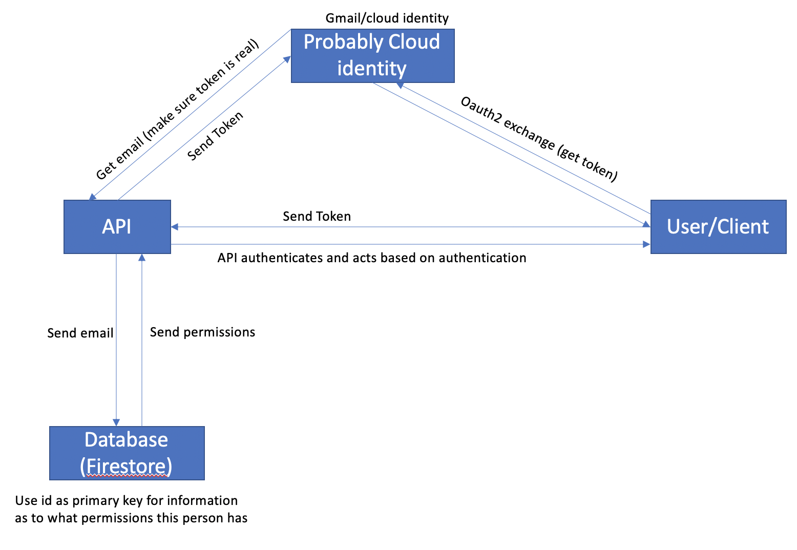

# Firebase Authentication
The purpose of this project is to create an easily reusable bit of code that will allow one to quickly authenticate people in a firebase application using Google's Cloud Identities Platform.
# 
# How it works
Google's Cloud Identities Platform offers a fast way to authenticate users. We can use this to get something unique to identify the person with (in this case, the emails are used as ids). There is a Firestore database that stores the emails and link them to roles (admins, readers, writers, etc). Whatever your api is doing can then start with the role of the current user.